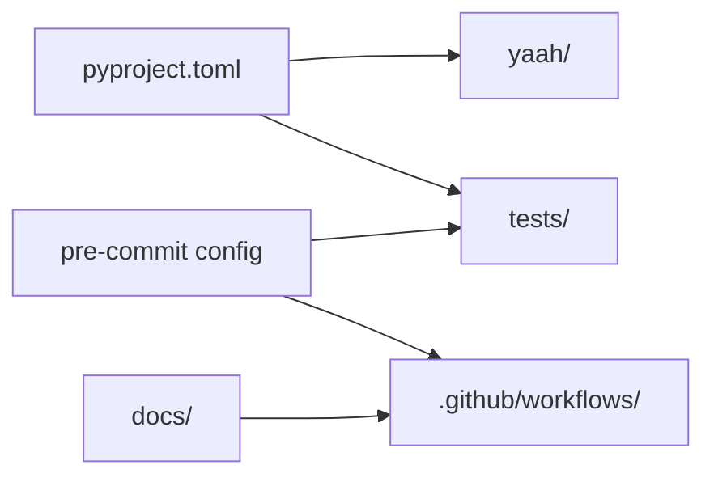

# Architecture — yaah

Top-level architecture index for **yaah** (Yet Another Agent Harness). Sub-component
architectures are linked from here as they are added (`docs/architecture/<component>.md`).

Maintained by [the-loop](https://github.com/MadaraUchiha-314/the-loop): the design phase
of a work item updates this index whenever a change alters the shape of the system, in the
same pull request as the change.

## What yaah is

**yaah is a Python package, published to PyPI as `yaah`, that develops itself through
the-loop.** Its product surface is a single function today; what exists in full is the
machinery around it — a pinned toolchain, one quality gate referenced by the git hooks,
the task runner and CI, an automated release, and a published documentation site.

The boundary is small and deliberate: yaah installs with **no runtime dependencies**, and
each future addition has to be justified in a work item's design before it arrives.

## Components

The repository is four trees, each with exactly one owner. That is the whole architecture
today; a tree grows its own `docs/architecture/<component>.md` once it is more than a
paragraph.

| Component | Responsibility | Detail |
|-----------|----------------|--------|
| `yaah/` | the importable package — all production code | [Repository toolchain](../capabilities/repository-toolchain.md) |
| `tests/` | `unit/` runs in the commit hook; `integration/` runs in CI and asserts on the repository's own configuration | [`testing-plan.md`](../specs/issue-3/testing-plan.md) |
| `docs/` | every markdown document **and** the VitePress site that renders them | [Documentation site](../capabilities/documentation-site.md) |
| `.github/workflows/` | `ci.yml` (merge gate), `release.yml` (version + publish), `docs.yml` (Pages) | [decision-003](../decisions/decision-003.md) |

## Cross-cutting concerns

- **One definition of a check.** `.pre-commit-config.yaml` is the only place a check is
  defined; the git hooks, `make check` and CI's quality job all reference it. Adding a
  check anywhere else is how the local and CI answers start to differ.
- **Reproducibility.** `uv.lock` pins every Python tool and `.python-version` pins the
  interpreter; CI names neither, it reads both. `docs/bun.lock` does the same for the site.
- **Privilege isolation.** The workflows are split so the one that runs untrusted
  pull-request code holds read-only permissions and no environment, while write and
  publish privileges sit on individual jobs of workflows only `main` can trigger. The
  boundaries are asserted by `tests/integration/test_workflows.py`.
- **No stored secrets.** Publishing to PyPI and deploying to Pages both use short-lived
  OIDC tokens. The repository holds no credential.
- **Fail loudly.** Nothing wraps a tool's output or swallows its exit code, and where a
  tool reports success on a failure — `vitepress build` on a render error —
  `docs/scripts/build.mjs` turns it back into a non-zero exit.

## Related

- [`docs/capabilities/capabilities.md`](../capabilities/capabilities.md) — the organized
  view of current behaviour, per capability.
- [`docs/decisions/decisions.md`](../decisions/decisions.md) — why the architecture is
  the way it is.
