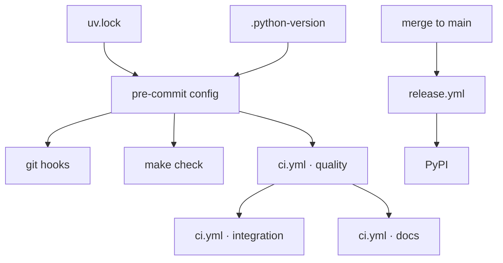

# Capability: Repository toolchain

> How yaah is linted, typed, tested, committed, versioned and published — one gate defined
> once and referenced by the git hooks, the task runner and CI. This doc is the single
> source of truth for the capability's **current** behaviour; the raw specs under
> `docs/specs/` remain the record of how each change arrived.

## What it is

Every check yaah runs is defined in exactly one place —
[`.pre-commit-config.yaml`](https://github.com/MadaraUchiha-314/yaah/blob/main/.pre-commit-config.yaml)
— and the three places a check *fires* all reference that definition rather than restating
it: a contributor's git hooks, the `Makefile`, and the CI workflow. The capability's users
are contributors (who want a local answer that CI will agree with) and reviewers (who want
a green check to mean something).

## Current behaviour

- The system SHALL resolve every Python tool through `uv run`, from the versions pinned in
  the committed `uv.lock`.
- The system SHALL resolve the interpreter from the committed `.python-version`, and CI
  SHALL name no version of its own.
- WHEN a contributor commits THEN the system SHALL run ruff lint, ruff format, pyright,
  the unit tests and markdownlint, and SHALL reject the commit if any fails.
- WHEN a contributor commits THEN the system SHALL reject a commit message that does not
  follow Conventional Commits v1.0.0, except for merges and aborts.
- WHEN a pull request is opened or updated THEN CI SHALL run
  `uv run pre-commit run --all-files` — the identical hook set — plus the integration
  suite and a documentation-site build.
- The integration suite SHALL NOT run as a git hook: the commit path stays fast.
- WHEN a push lands on `main` THEN the system SHALL derive the next version from the
  Conventional Commits since the last tag, and IF none warrants a release THEN it SHALL
  publish nothing and exit successfully.
- WHEN a release is warranted THEN the system SHALL commit the bump, tag it `v<version>`,
  push both to `main`, cut a GitHub Release, and publish the distribution to PyPI as
  `yaah` over OIDC.
- The system SHALL store no PyPI credential. Publishing authority SHALL be a short-lived
  token bound to this repository, this workflow and the `pypi` environment.
- `ci.yml` SHALL request no `id-token` permission and SHALL bind no deployment
  environment, so untrusted pull-request code holds nothing worth stealing.
- `release.yml` SHALL grant `contents: write` to its bump job and `id-token: write` to its
  publish job only, never workflow-wide.
- WHEN the release's own `bump:` commit lands on `main` THEN the system SHALL NOT
  re-enter.
- The `yaah` package SHALL expose `hello_world`, importable as `from yaah import
  hello_world`, returning `Hello, <name>!` and raising `TypeError`/`ValueError` rather
  than greeting an invalid name.

## Design

Pointers, not copies:

- [`docs/specs/issue-3/design.md`](../specs/issue-3/design.md) — the components, the
  per-job privilege scoping, and why there are three workflows.
- [decision-001](../decisions/decision-001.md) — the tool choices.
- [decision-002](../decisions/decision-002.md) — the interpreter pin.
- [decision-003](../decisions/decision-003.md) — versioning, publishing and the workflow
  split.
- [Tech stack](../guide/tech-stack.md) and
  [Local development](../guide/local-development.md) — the same facts for a reader who
  wants to use them rather than review them.

## History

| Work item | What changed | Links |
|-----------|--------------|-------|
| issue-3 | Established the capability: uv/ruff/pyright/pytest, commitizen, pre-commit hooks, `make check`, CI on pull requests, and the release-to-PyPI path. | [spec](../specs/issue-3/), [decision-001](../decisions/decision-001.md), [decision-002](../decisions/decision-002.md), [decision-003](../decisions/decision-003.md) |
