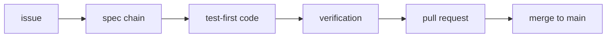

# Contributing

**Every change to yaah is a work item with a ticket, and the spec chain is written before
the code.** That is not a house style — it is
[the-loop](https://github.com/MadaraUchiha-314/the-loop), the product-development-lifecycle
harness this repository runs itself through. The operating model lives in
[`AGENTS.md`](https://github.com/MadaraUchiha-314/yaah/blob/main/AGENTS.md); this page is
the short version for a human sending a pull request.

## The shape of a change



1. **Open an issue.** Nothing is worked without one.
2. **Write the spec chain** under `docs/specs/issue-<n>/`, scaled to the change — a typo
   fix does not need a design document.
3. **Write the test first.** No production code without a failing test that motivates it;
   a bug fix reproduces the bug red before it goes green.
4. **Keep the paper trail.** Decisions go to [`docs/decisions/`](/decisions/decisions);
   mid-flight assumptions go to [`conflicts.md`](/decisions/conflicts).
5. **Update the docs in the same pull request.** Capability docs and anything on this site
   that the change made wrong are part of the change, never a follow-up.

## Before you push

```bash
make check
```

Lint, format, types, unit tests and integration tests — the same set CI runs. If the git
hooks are installed (`make hooks`), most of this already ran at commit time.

## Commit messages

[Conventional Commits](https://www.conventionalcommits.org/en/v1.0.0/), enforced by the
`commit-msg` hook. The type you choose decides the next released version — see
[Releases](/guide/releases). With squash-merge, **the pull-request title is the commit
message**, so it has to conform too.

## What a reviewer looks for

- The change does what its requirements say, and the tests prove it rather than assert it.
- Nothing new was added that the design did not justify — new dependencies especially.
- The security-relevant parts name the trust boundary they cross and the negative test
  that holds it.
- The documentation that the change made wrong was fixed in the same pull request.
