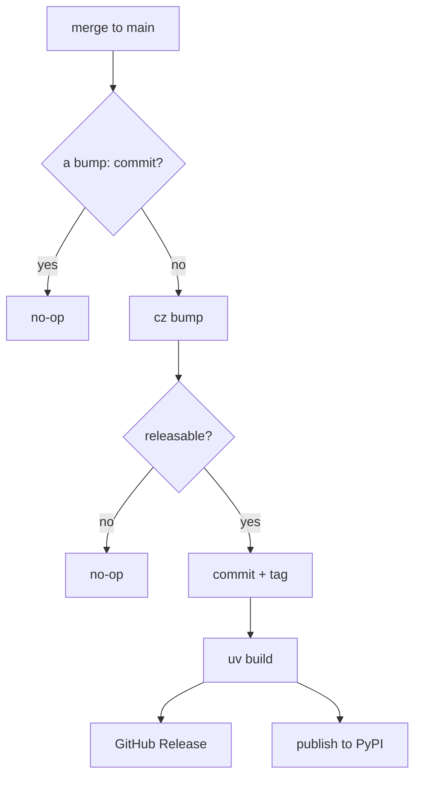

# Releases

**A release is a consequence of merging, not a separate ritual.** A push to `main` derives
the next version from the commit messages, tags it, pushes the tag and the bumped version
back to `main`, cuts a GitHub Release, and publishes the distribution to PyPI. Nobody
chooses a version number, and nobody holds a PyPI token.

## How the version is decided

commitizen reads the [Conventional Commits](https://www.conventionalcommits.org/en/v1.0.0/)
since the last tag:

| Commit type | Effect on the version |
|---|---|
| `feat:` | minor bump — `0.1.0` → `0.2.0` |
| `fix:`, `perf:` | patch bump — `0.1.0` → `0.1.1` |
| `feat!:` or a `BREAKING CHANGE:` footer | major bump — `0.1.0` → `1.0.0` |
| `docs:`, `chore:`, `ci:`, `test:`, `refactor:`, `style:` | none |

If nothing since the last tag warrants a release, the workflow exits successfully and
publishes nothing.

`.cz.toml` holds the canonical version, and its `version_files` keeps `pyproject.toml` in
lockstep — one bump rewrites both in the same commit, so the published distribution can
never disagree with the git tag.

## How publishing is authorized

PyPI **Trusted Publishing**. The `publish-pypi` job requests a short-lived OIDC token,
PyPI verifies that it came from this repository, this workflow and the `pypi` environment,
and exchanges it for upload rights that expire with the job. There is no token in the
repository, in a secret, or on anyone's machine.

Privileges are scoped per job rather than per workflow:

| Job | Can do | Cannot do |
|---|---|---|
| `release` | write to `main`, push a tag, cut a Release | authenticate to PyPI |
| `publish-pypi` | upload to PyPI | write anything to the repository |

`ci.yml`, which runs untrusted pull-request code, holds neither.
[`tests/integration/test_workflows.py`](https://github.com/MadaraUchiha-314/yaah/blob/main/tests/integration/test_workflows.py)
asserts each of those boundaries, so an edit that widens one fails the test suite.

## First release

The workflow bootstraps itself: with no `v*` tag yet, it treats the version already in the
repository as released (tagging it locally, never pushing that tag) so the first bump is
computed only from what has merged since.

## Manual release

`workflow_dispatch` on the **Release** workflow runs the same path by hand. It still
publishes only if the commits since the last tag warrant it.
