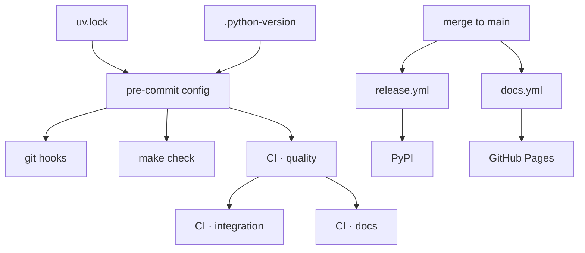

# Tech stack

**Every tool below is pinned, and every tool below runs the same way in three places —
your shell, your git hooks, and CI.** That is the point of the list, not the list itself:
a check defined once and referenced everywhere cannot drift, and drift is what turns a
green local run into a red pull request.

| Concern | Tool | Configured in | Pinned by |
|---|---|---|---|
| Language | Python 3.13 | [`.python-version`](https://github.com/MadaraUchiha-314/yaah/blob/main/.python-version) | the file itself |
| Package manager | [uv](https://docs.astral.sh/uv/) | `pyproject.toml` | `uv.lock` |
| Build backend | [hatchling](https://hatch.pypa.io/) | `pyproject.toml` | `uv.lock` |
| Linter & formatter | [ruff](https://docs.astral.sh/ruff/) | `[tool.ruff]` in `pyproject.toml` | `uv.lock` |
| Type checker | [pyright](https://microsoft.github.io/pyright/) (strict) | `[tool.pyright]` in `pyproject.toml` | `uv.lock` |
| Tests | [pytest](https://docs.pytest.org/) | `[tool.pytest.ini_options]` in `pyproject.toml` | `uv.lock` |
| Markdown lint | [markdownlint-cli2](https://github.com/DavidAnson/markdownlint-cli2) | `.markdownlint-cli2.jsonc` | exact version in the hook |
| Commit messages | [commitizen](https://commitizen-tools.github.io/commitizen/) | `.cz.toml` | `uv.lock` |
| Git hooks | [pre-commit](https://pre-commit.com/) | `.pre-commit-config.yaml` | `uv.lock` |
| Task runner | `make` | `Makefile` | — |
| Docs site | [VitePress](https://vitepress.dev/) via [bun](https://bun.sh/) | `docs/.vitepress/config.mts` | `docs/bun.lock` |
| CI / release / publish | GitHub Actions → PyPI, GitHub Pages | `.github/workflows/` | pinned action refs |

## How they fit together

Read that diagram from the top: `.pre-commit-config.yaml` is the **only** place a check is
defined. CI's quality job runs `uv run pre-commit run --all-files` — the identical hook
set, not a re-implementation of it.

## Why these tools

Most of the list was specified by
[issue #3](https://github.com/MadaraUchiha-314/yaah/issues/3); the reasoning behind the
choices that were actually open is recorded in the decision log:

- [decision-001](/decisions/decision-001) — uv, ruff, pyright and pytest as the Python
  toolchain.
- [decision-002](/decisions/decision-002) — why the interpreter pin is Python 3.13.
- [decision-003](/decisions/decision-003) — commitizen and PyPI Trusted Publishing for
  releases, split across three workflows.
- [decision-004](/decisions/decision-004) — VitePress and bun for this site.

## What is deliberately absent

- **No runtime dependencies.** `yaah` installs with none, and each addition has to be
  justified in a work item's design first.
- **No monorepo tooling.** One package, one `pyproject.toml`. `docs/` carries a
  `package.json` because VitePress is a Node program, not because it is a second
  published artifact.
- **No stored secrets.** Publishing to PyPI and deploying to Pages both use short-lived
  OIDC tokens.
