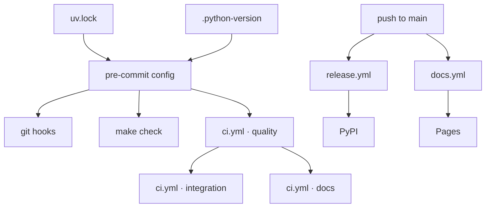

# Design: repo tooling setup

> Phase 2 of 3 (requirements → design → tasks). Derives from the approved
> requirements. MUST be reviewed and approved before moving to tasks breakdown.

## Overview

**One command definition, referenced from three places.** Every check this work item adds
is defined once — as a `pre-commit` hook invoking a tool through `uv run` — and then
*referenced* by the developer's git hooks, by the `make` target, and by CI. Nothing
re-implements a check; CI's quality job is literally
`uv run pre-commit run --all-files`. That single choice is what satisfies the
"same tooling everywhere" rule without a second config to keep in sync, and it is why the
matrix of tools below has no CI column: there is nothing different to say.



## Architecture

The repository becomes four cooperating trees, each with one owner:

| Tree | Holds | Owned by |
|------|-------|----------|
| `yaah/` | the importable package — all production code | `pyproject.toml` / hatchling |
| `tests/` | `unit/` (hook-fast) and `integration/` (CI-only) | `pytest` |
| `docs/` | every markdown document **and** the VitePress site that renders them | `docs/package.json` |
| `.github/workflows/` | `ci.yml`, `release.yml`, `docs.yml` | GitHub Actions |

Two configuration files sit above them and are the reason the trees stay consistent:
`pyproject.toml` (Python project, tool configuration, dev dependency group) and
`.pre-commit-config.yaml` (the check definitions). `.cz.toml` owns the version; `uv.lock`
and `.python-version` own the resolution.

`docs/` is deliberately **not** split into "the-loop's docs" and "the site's docs". The
loop already writes specs, capabilities, decisions and learnings there, and issue #3 asks
for the site to be rooted at `docs/` — so the site's `srcDir` is `docs/` itself and those
artifacts become pages. A checked-in artifact nobody can find is a checked-in artifact
nobody reads.

### Non-monorepo, deliberately

There is no workspace tool. `pyproject.toml` describes one distribution built from one
package, and `docs/` carries its own `package.json` purely because VitePress is a Node
program — it is a tool directory, not a second published artifact. Adding a uv workspace
now would buy nothing and cost every contributor an indirection
(`reference/minimalism.md`: YAGNI first).

## Components & interfaces

### `yaah/` — the package

- **Responsibility:** everything importable. This work item puts exactly one function in
  it, so that the build, the tests, the type checker and the publish path all have real
  code to carry.
- **Public interface:**

  ```python
  def hello_world(name: str = "World") -> str: ...
  ```

  Returns `f"Hello, {name}!"`. Raises `TypeError` when `name` is not a `str`, and
  `ValueError` when it is empty or only whitespace.
- **Re-export:** `yaah/__init__.py` re-exports `hello_world` and declares `__all__`, so the
  documented import form `from yaah import hello_world` is the supported one and
  `yaah.hello` stays an implementation detail.

### `pyproject.toml` — project + tool configuration

One file configures four tools, because each of them reads `pyproject.toml` natively and a
separate `ruff.toml`/`pytest.ini`/`pyrightconfig.json` would be three more files to keep
in sync:

| Table | Configures |
|-------|-----------|
| `[project]` | name `yaah`, version, `requires-python`, Apache-2.0 license, URLs |
| `[dependency-groups] dev` | ruff, pyright, pytest, pre-commit, commitizen |
| `[tool.ruff]` / `[tool.ruff.lint]` | line length, target version, rule selection |
| `[tool.pyright]` | `include`, strict mode, the in-repo `.venv` |
| `[tool.pytest.ini_options]` | `testpaths`, `pythonpath`, markers |

The build backend is **hatchling** with `packages = ["yaah"]`.

### `.pre-commit-config.yaml` — the check definitions

Every hook is `language: system` and enters through `uv run`, so the tool that runs is the
one `uv.lock` pins — whether the caller is `git commit`, `make`, or a CI job. The markdown
linter is the one exception: it is a Node tool, pinned by exact version through `npx`.

| Hook | Command | Stage | Scope |
|------|---------|-------|-------|
| `ruff-lint` | `uv run ruff check --fix` | pre-commit, pre-push | `*.py` |
| `ruff-format` | `uv run ruff format` | pre-commit, pre-push | `*.py` |
| `pyright` | `uv run pyright` | pre-commit, pre-push | repo (on any `.py` change) |
| `pytest-unit` | `uv run pytest tests/unit` | pre-commit, pre-push | repo (on any `.py` change) |
| `markdownlint` | `npx --yes markdownlint-cli2@0.18.1` | pre-commit, pre-push | `*.md` |
| `commitizen` | `uv run cz check --allow-abort --commit-msg-file` | commit-msg | the message |

`default_install_hook_types: [pre-commit, pre-push, commit-msg]` means a single
`pre-commit install --install-hooks` wires all three — a contributor cannot install half
the gate.

**Integration tests are deliberately not a hook.** They are the one check CI runs that the
commit path does not (R6.2): hooks must stay fast enough that people leave them installed.

### `Makefile` — the root task runner

Thin wrappers, no logic: `install-dev`, `lint`, `format`, `format-check`, `typecheck`,
`test`, `test-integration`, `docs`, `check` (everything), `hooks` (installs the git hooks).
Its value is that `make check` answers "what does CI run?" in one line, from the root, per
the-loop's *all scripts run from the project root*.

### `.cz.toml` — version + commit format

commitizen owns the canonical version. `version_files` keeps `pyproject.toml`'s
`[project] version` in lockstep, so a bump rewrites both in one commit and the published
distribution can never disagree with the tag.

### The three workflows

| Workflow | Trigger | Jobs | Why separate |
|----------|---------|------|--------------|
| `ci.yml` | `pull_request`, `push: main` | `quality` (pre-commit), `integration` (pytest), `docs` (vitepress build) | the merge gate |
| `release.yml` | `push: main`, `workflow_dispatch` | `release` (cz bump, tag, push, build), `publish-pypi` | holds `contents: write` and OIDC — kept away from PR-triggered code |
| `docs.yml` | `push: main` (docs paths), `workflow_dispatch` | `build`, `deploy` | Pages needs its own `pages`/`id-token` permissions and the `github-pages` environment |

Splitting them is a **security** decision, not an organizational one — see
§ Security design.

### `docs/` — the VitePress site

- `docs/package.json` — `vitepress` as the only dependency; scripts `docs:dev`,
  `docs:build`, `docs:preview`. Package manager: **bun** (the repository has no JS signal,
  so the-loop's JS/TS fallback applies), with a committed `bun.lock`.
- `docs/.vitepress/config.mts` — `srcDir` is `docs/`, `base: "/yaah/"` (GitHub Pages serves
  the repository at that path), `cleanUrls`, local search, and a nav/sidebar covering the
  guide plus the loop's own trees.
- **Specs sidebar is generated from the filesystem.** `docs/specs/*/` is read at build time
  and each work item becomes a collapsed group ordered by issue number, so R8.6 holds
  without a human editing the nav for every new work item.
- **`markdown.html: false`.** The loop's documents are full of angle-bracket placeholders
  (`<id>`, `<phase>`, `<nnn>`) written for GitHub's renderer. VitePress compiles markdown
  as a Vue template and would treat those as unclosed tags and fail the build; disabling
  raw-HTML passthrough makes them render as literal text, exactly as GitHub shows them.
  Mermaid fences are unaffected.
- **`ignoreDeadLinks: true`.** Several checked-in documents link to repository paths
  outside `docs/` (`AGENTS.md`, `.the-loop/harness-config.yaml`). Those links are correct
  on GitHub, which is where they are read; rewriting them to satisfy the site would break
  the canonical copy.

## UI/UX design

N/A. The one user-visible surface is the VitePress default theme, used unmodified — there
is no bespoke screen, flow or component to prototype. Evidence of the built site is
captured as part of verification rather than as a design artifact.

## Data models

No persistence, no schema. The only structured data this work item introduces is
configuration, and every file is validated by the tool that owns it:

| File | Format | Validated by |
|------|--------|-------------|
| `pyproject.toml` | TOML (PEP 621) | `uv sync`, `uv build` |
| `uv.lock` | TOML | `uv sync --locked` |
| `.cz.toml` | TOML | `cz check` / `cz bump` |
| `.pre-commit-config.yaml` | YAML | `pre-commit run` |
| `.github/workflows/*.yml` | YAML | GitHub Actions on push |

## Error handling

- **`hello_world` fails loudly.** A non-`str` argument raises `TypeError`; a blank string
  raises `ValueError`. Neither is coerced, because a greeting addressed to `None` is a bug
  that should surface at the call site (`reference/observability.md`: the same behaviour at
  dev-time and runtime).
- **Every gate fails the build.** No hook, target or job swallows a non-zero exit; each
  tool's own output is the diagnostic, unwrapped.
- **The release is a no-op or a failure, never a partial.** commitizen exits 21
  (`NoneIncrementExit`) or 3 (`NoCommitsFoundError`) when nothing warrants a release; those
  two codes are translated into `released=false` and the publish job is skipped. Any other
  non-zero exit fails the workflow. The build, tag-push and publish steps each gate on
  `released == 'true'`, so a failed bump publishes nothing.

## Security design

Every boundary named in the requirements' **Security considerations** is enforced by a
concrete mechanism below.

- **AuthN/AuthZ.** Nothing this work item adds authenticates a user. The two machine
  identities are (a) `GITHUB_TOKEN`, scoped per job, and (b) a short-lived OIDC token that
  PyPI exchanges for upload rights. Authorization to *reach* the publish path is branch
  protection on `main` plus the `pypi` environment's own protection rules.
- **Input validation & injection surfaces.**
  - *Untrusted ingress 1 — a pull-request branch.* `ci.yml` triggers on `pull_request`,
    never `pull_request_target`, so a fork's code runs against a **read-only** token in a
    fork-scoped context and cannot write to the base repository.
  - *Untrusted ingress 2 — commit messages.* They reach `cz check` and `cz bump` as file
    contents and command output, never as shell input: no workflow interpolates a commit
    message into a `run:` script. The one place a commit message appears in an
    expression is the release workflow's re-entry guard —

    ```yaml
    if: ${{ !startsWith(github.event.head_commit.message, 'bump:') }}
    ```

    — which GitHub Actions evaluates itself. Nothing is handed to a shell. Values that
    *do* reach a shell — the computed version, derived from `.cz.toml` — are passed
    through an `env:` mapping and expanded by the shell, never interpolated into the
    script text before it is parsed.
  - *Untrusted ingress 3 — `hello_world(name)`.* Validated by type and emptiness; the value
    is only ever interpolated into a returned string, never into a command, path or query.
  - No SQL, no filesystem path construction from input, no subprocess invocation with
    untrusted arguments exists anywhere in this change.
- **Secrets handling.** The repository stores **no** secret. PyPI publishing uses Trusted
  Publishing, so the credential is minted per run and expires; GitHub Pages uses the same
  OIDC mechanism. `GITHUB_TOKEN` is never written to a file or echoed.
- **Least privilege** — the reason there are three workflows rather than one:

  | Workflow | `permissions` | Environment |
  |----------|---------------|-------------|
  | `ci.yml` | `contents: read` (workflow-wide) | none |
  | `release.yml` | `contents: read` workflow-wide; `contents: write` on the `release` job; `id-token: write` on the `publish-pypi` job **only** | `pypi` on the publish job |
  | `docs.yml` | `contents: read`, `pages: write`, `id-token: write` | `github-pages` on the deploy job |

  The elevated permissions live only on jobs triggered by a push to `main` — a branch a
  fork cannot write to. A pull request from a fork can therefore execute arbitrary code in
  `ci.yml` and still hold nothing worth stealing.
- **Fail-closed behaviour.**
  - `uv sync --locked` in CI fails if `uv.lock` does not satisfy `pyproject.toml`, rather
    than resolving something newer.
  - The publish job runs only when `needs.release.outputs.released == 'true'`; there is no
    path that publishes a distribution the release job did not build.
  - `if: !startsWith(github.event.head_commit.message, 'bump:')` stops the release from
    re-entering on its own bump commit.
  - `concurrency: group: release, cancel-in-progress: false` makes two releases impossible
    rather than racy.
  - Third-party actions are pinned to published major tags from known publishers
    (`actions/*`, `astral-sh/setup-uv`, `oven-sh/setup-bun`, `pypa/gh-action-pypi-publish`).
- **Abuse-case coverage:**

  | Abuse case | Mechanism | Proving test |
  |------------|-----------|--------------|
  | A1 — fork PR reaches a credential | `ci.yml` requests no `id-token` and binds no environment | T8 — `tests/integration/test_workflows.py::test_ci_workflow_holds_no_publish_credentials` |
  | A2 — PR runs with a write token | `on: pull_request` only; no `pull_request_target` | T8 — `test_no_workflow_uses_pull_request_target` |
  | A3 — over-broad release permissions | `id-token: write` / `contents: write` declared per job | T8 — `test_release_scopes_privileges_per_job` |
  | A4 — forged version via commit message | commits reach `main` only through a reviewed PR; no `github.event`, `inputs.`, `steps.` or `needs.` value is interpolated into a `run:` block — such values arrive via `env:` | T8 — `test_no_workflow_interpolates_untrusted_input_into_a_shell` |
  | A5 — unpinned third-party action | every `uses:` carries an explicit version ref | T8 — `test_every_action_reference_is_pinned` |
  | A6 — release loop on its own bump | `if: !startsWith(…, 'bump:')` + `concurrency: release` | T8 — `test_release_does_not_re_enter_on_its_own_bump_commit` |
  | A7 — `hello_world` accepts junk | type and emptiness validation | T1 — `tests/unit/test_hello.py` negative cases |

  The workflow-shape tests are real tests over the checked-in YAML, not a promise: a future
  edit that grants `id-token: write` to `ci.yml` turns a green suite red.

## Testing strategy

Requirements map to tests along the boundary between *what the code does* and *what the
repository is configured to do*. `hello_world`'s behaviour (R3) is unit-tested directly.
Everything else this work item delivers is configuration, and configuration is proved two
ways: by **executing** it (running `pre-commit`, `pytest`, `uv build`, `vitepress build` —
which is what the verification activities do) and by **asserting on its shape** where
executing it would mean triggering a release or a deployment. The workflow files therefore
get integration tests that parse the YAML and assert the security invariants above; those
carry Gherkin docstrings linking back to their requirement, per
`testing.gherkinDocstrings: required`.

No API contracts are involved — yaah exposes none, so `specs/openapi/` and `specs/graphql/`
stay absent.

The executable detail — the full matrix, the `n/a` rows and their reasons, the
verification environment and the evidence plan — lives in
[`testing-plan.md`](testing-plan.md).

## Trade-offs & decisions

- **Python 3.13, not 3.14** ([decision-002](../../decisions/decision-002.md)). "Latest
  Python 3" is pinned to the latest **stable** release the pinned toolchain can resolve.
  The alternative — pinning 3.14 in CI while no local environment can install it — would
  break the one rule this work item exists to enforce. The pin is one line in
  `.python-version`.
- **Root-level package, no `src/` layout.** The issue specifies `yaah/` at the repository
  root. The `src/` layout's benefit — you cannot accidentally import the un-built package —
  is bought instead by `pythonpath = ["."]` being explicit and by CI building the wheel.
- **pyright in strict mode.** Cheap to adopt on an empty codebase and expensive to retrofit
  later; the gate is only painful for code that was going to be ambiguous anyway.
- **bun for the docs site** ([decision-004](../../decisions/decision-004.md)). The
  repository carries no JS signal, so the-loop's JS/TS fallback (`bun`) applies rather than
  a coin toss.
- **Three workflows, not one** ([decision-003](../../decisions/decision-003.md)).
  Permission scoping, argued above.
- **commitizen over semantic-release** ([decision-003](../../decisions/decision-003.md)).
  Keeps the release path inside the Python toolchain already pinned in `uv.lock`; adding
  Node to the release path would mean a second version-resolution story.

## Open questions

None outstanding. The single ambiguity — "latest version of python 3" — was resolved with a
default and logged in [`conflicts.md`](../../decisions/conflicts.md).

## Review comments

_None yet._
