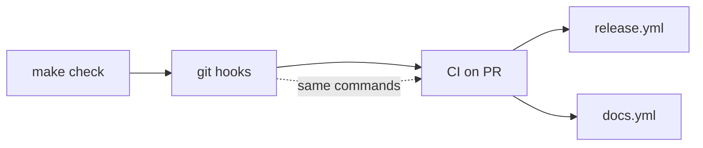

# Requirements: repo tooling setup

> Phase 1 of 3 (requirements → design → tasks). Following the Kiro spec approach
> (https://kiro.dev/docs/specs/). This phase MUST be reviewed and approved by the
> required collaborators before moving to design.

## Introduction

**yaah has no source tree, so this work item builds the floor every later work item
stands on.** [Issue #3](https://github.com/MadaraUchiha-314/yaah/issues/3) asks for the
whole Python toolchain at once — package manager, linter, type checker, test runner,
commit linter, git hooks, CI, release-to-PyPI, and a published documentation site — plus
one `hello_world` function to prove the pipeline carries real code end to end.

The problem it solves is drift. A repository that acquires its tooling piecemeal ends up
with a linter that CI does not run, a formatter that only some machines have, and a
release that works once. This work item wires **one set of commands** and points the local
hooks and the CI jobs at exactly that set, so "it passed locally" and "it passed in CI"
cannot disagree — the rule the-loop states as *CI/CD must use exactly the same tooling as
local* (`reference/tooling.md`).

## Requirements

### Requirement 1 — Python project skeleton managed by uv

**User story:** As a contributor, I want the repository to be a single uv-managed Python
project with its dependencies installed in-tree, so that I can go from clone to a working
environment with one command and get the same versions everyone else has.

#### Acceptance criteria (EARS)

1. WHEN a contributor runs `uv sync` in the repository root THEN the system SHALL create a
   `.venv/` directory inside the repository and install every declared dependency into it.
2. WHEN dependencies are resolved THEN the system SHALL record the exact resolution in a
   committed `uv.lock`, and every local command and CI job SHALL resolve from that lock.
3. The project metadata SHALL live in a single root `pyproject.toml` declaring the
   distribution name `yaah`.
4. WHEN a contributor runs `uv python pin` or reads the pinned interpreter THEN the system
   SHALL report the version recorded in a committed `.python-version`, and CI SHALL use
   that same file as its interpreter source.
5. All importable code SHALL live under a root-level `yaah/` package, such that
   `from yaah import ...` is the only import form callers need.

### Requirement 2 — Lint, format and type checks

**User story:** As a contributor, I want lint, format and type checks available as root
commands, so that the same checks run on my machine, in my git hooks and in CI.

#### Acceptance criteria (EARS)

1. WHEN `ruff check` runs from the repository root THEN the system SHALL lint every Python
   file in the repository and exit non-zero on any violation.
2. WHEN `ruff format --check` runs from the repository root THEN the system SHALL exit
   non-zero if any Python file is not formatted.
3. WHEN `pyright` runs from the repository root THEN the system SHALL type-check the
   `yaah/` package and the test suite and exit non-zero on any error.
4. WHEN markdown files change THEN the system SHALL lint them with `markdownlint-cli2` at a
   pinned version — documentation is first-class and lint covers ALL files.
5. IF a tool version is pinned for local use THEN CI SHALL use the same pinned version,
   resolved from `uv.lock` for Python tools and from an exact version tag for Node tools.

### Requirement 3 — Test suite with a worked example

**User story:** As a contributor, I want a runnable test suite with a real example, so that
the TDD invariant has somewhere to land from the first commit.

#### Acceptance criteria (EARS)

1. The `yaah` package SHALL expose exactly one public function, `hello_world`, importable
   as `from yaah import hello_world`.
2. WHEN `hello_world()` is called with no argument THEN the system SHALL return the string
   `Hello, World!`.
3. WHEN `hello_world(name)` is called with a non-empty string THEN the system SHALL return
   `Hello, <name>!`.
4. IF `hello_world` is called with a value that is not a string, or with a string that is
   empty or only whitespace, THEN the system SHALL raise a `ValueError` or `TypeError`
   rather than returning a greeting.
5. WHEN `pytest` runs from the repository root THEN the system SHALL discover unit tests
   under `tests/unit/` and integration tests under `tests/integration/` and report their
   results.
6. Every integration test SHALL carry a Gherkin docstring
   (`Feature:`/`Scenario:`/Given-When-Then) naming the scenario under test and linking the
   requirement it proves (`testing.gherkinDocstrings: required`).

### Requirement 4 — Conventional Commits enforced by commitizen

**User story:** As a maintainer, I want every commit message to follow Conventional
Commits, so that the release version can be derived from history rather than chosen by
hand.

#### Acceptance criteria (EARS)

1. WHEN a commit message does not match Conventional Commits v1.0.0 THEN the `commit-msg`
   hook SHALL reject the commit.
2. WHEN the commit is a merge or an aborted commit THEN the hook SHALL allow it through
   (`cz check --allow-abort`).
3. The enforcement SHALL use commitizen (`cz check`), configured in `.cz.toml` — not a
   bespoke validator.
4. `.cz.toml` SHALL be the single source of truth for the project version, and a bump
   SHALL rewrite every other file carrying that version in the same commit.

### Requirement 5 — Git hooks that run the same checks as CI

**User story:** As a contributor, I want the git hooks to run lint, type checks and unit
tests before my commit lands, so that CI tells me nothing my own machine could have told
me first.

#### Acceptance criteria (EARS)

1. WHEN `pre-commit install --install-hooks` runs THEN the system SHALL install the
   `pre-commit`, `pre-push` and `commit-msg` hook types.
2. WHEN a commit is made THEN the hooks SHALL run ruff lint, ruff format, pyright,
   markdownlint and the unit test suite.
3. IF any hook fails THEN the system SHALL block the commit.
4. Every hook SHALL invoke its tool through `uv run` so the version in `uv.lock` is the
   version that runs — the same one CI resolves.

### Requirement 6 — CI on every pull request

**User story:** As a reviewer, I want every pull request to run the full local gate plus
the integration tests, so that a green check means the branch is actually mergeable.

#### Acceptance criteria (EARS)

1. WHEN a pull request is opened or updated THEN CI SHALL run
   `uv run pre-commit run --all-files` — the identical hook set a contributor runs locally.
2. WHEN a pull request is opened or updated THEN CI SHALL additionally run the integration
   test suite, which the local pre-commit hook does not run.
3. WHEN a push lands on `main` THEN CI SHALL run the same jobs it runs on a pull request.
4. WHEN the documentation site's sources change THEN CI SHALL build the site, so a broken
   site fails the pull request rather than the deployment.
5. IF any CI job fails THEN the workflow SHALL exit non-zero and the pull request SHALL
   report a failing check.

### Requirement 7 — Release to PyPI on merge to main

**User story:** As a maintainer, I want a merge to `main` to version, tag, publish and push
the new version back, so that releasing is a consequence of merging rather than a separate
ritual.

#### Acceptance criteria (EARS)

1. WHEN a push lands on `main` THEN the workflow `release.yml` SHALL compute the next
   version from the Conventional Commits since the last tag (`feat` → minor, `fix` →
   patch, `BREAKING CHANGE`/`!` → major).
2. IF no commit since the last tag warrants a release THEN the workflow SHALL exit
   successfully without publishing.
3. WHEN a release is warranted THEN the workflow SHALL commit the version bump, tag it
   `v<version>`, and push both the commit and the tag back to `main` — so `main` carries
   the new version number.
4. WHEN the bump commit itself lands on `main` THEN the workflow SHALL NOT re-enter.
5. WHEN a release is warranted THEN the workflow SHALL build the distribution and publish
   it to PyPI as the project `yaah` from a job bound to the `pypi` environment.
6. Publishing SHALL use PyPI Trusted Publishing (GitHub Actions OIDC). The workflow SHALL
   store no PyPI token.

### Requirement 8 — A published documentation site

**User story:** As a reader, I want the project's documentation published as a searchable
site, so that onboarding, developer, architecture and decision docs are one link rather
than a directory listing on GitHub.

#### Acceptance criteria (EARS)

1. All project documentation SHALL live under `docs/` and SHALL be authored in markdown.
2. The site SHALL be generated by VitePress rooted at `docs/`, with a home page, a
   navigation bar, per-section sidebars and local search.
3. WHEN a push lands on `main` THEN the system SHALL build the site and deploy it to GitHub
   Pages at `https://madarauchiha-314.github.io/yaah/`.
4. The site SHALL surface the documents the-loop maintains — specs, capabilities,
   decisions, learnings and architecture — so a checked-in artifact is a readable page.
5. The documentation SHALL describe the project's tech stack and its local development
   instructions, including how to install the git hooks.
6. WHEN a spec directory is added under `docs/specs/` THEN the site's sidebar SHALL include
   it without a manual edit to the navigation config.

## Non-functional requirements

- **Reproducibility.** Every command a contributor runs resolves its tools from
  `uv.lock` (Python) or an exact pinned version (Node). No command depends on what happens
  to be on `PATH`.
- **One command to check everything.** A root task runner exposes the full gate as a single
  target, so "what does CI run?" has a one-line answer.
- **Cold-start cost.** A clean clone reaches a green `make check` with two commands
  (`uv sync`, `make check`) and no manual tool installation beyond `uv` and Node.
- **Observability.** Every check reports which tool failed and on which file; no wrapper
  swallows a tool's output.

## Security considerations

> Threat-model-lite, captured with the requirements (always required).

- **Actors & trust:**
  - *Maintainers* (`@MadaraUchiha-314`) — trusted; they merge and release.
  - *Pull-request authors, including from forks* — **untrusted**. Their branch content is
    executed by CI as soon as a workflow runs on it.
  - *GitHub Actions itself* and the third-party actions the workflows reference —
    **semi-trusted**; each is code running with the job's token.
  - *PyPI* and *GitHub Pages* — publish targets, reached over OIDC.
- **Trust boundaries & data:**
  - **PR branch content → CI runner.** The `ci.yml` job checks out and executes untrusted
    code (tests, hooks, a docs build). This is the primary boundary this work item creates.
  - **`main` → PyPI.** `release.yml` turns a merge into a published artifact. The
    credential is a short-lived OIDC token minted for one job, not a stored secret.
  - **`main` → GitHub Pages.** `docs.yml` publishes a site from repository content.
  - **Sensitive data stored:** none. The repository holds no secret, token or credential,
    and this work item adds none — Trusted Publishing exists precisely so that no PyPI
    token is stored.
- **Abuse cases (EARS):**
  1. WHEN a workflow runs against a fork's pull-request branch THEN the system SHALL NOT
     expose any publish credential to it: `ci.yml` SHALL request no `id-token` permission
     and SHALL be bound to no deployment environment.
  2. WHEN a pull request modifies a workflow file THEN the system SHALL still run that
     pull request under `pull_request` (not `pull_request_target`), so the untrusted branch
     never executes with a write-scoped token against the base repository.
  3. WHEN `release.yml` runs THEN the system SHALL grant `id-token: write` to the publish
     job **only**, and `contents: write` to the version-bump job only — never
     workflow-wide.
  4. WHEN an attacker pushes a commit whose message claims a `BREAKING CHANGE` THEN the
     blast radius SHALL be a wrong version number, not an unreviewed publish — the commit
     can only reach `main` through a reviewed pull request.
  5. WHEN a third-party action is referenced THEN the system SHALL pin it to a published
     major-version tag from a known publisher, so an arbitrary upstream commit cannot
     silently enter the release path.
  6. WHEN the version-bump commit is pushed back to `main` THEN the system SHALL NOT
     re-trigger a release, so a loop cannot exhaust the publish path.
- **Fail closed:**
  - IF the version cannot be computed, the build fails, or the tag already exists THEN the
    workflow SHALL exit non-zero and publish nothing.
  - IF `uv sync` cannot resolve from the committed lock THEN every downstream check SHALL
    fail rather than silently resolve a different version.
  - IF the `pypi` environment's protection rules are not satisfied THEN the publish job
    SHALL NOT run.

## Out of scope

- Any yaah product behaviour beyond `hello_world` — this is the toolchain, not the agent
  harness.
- Container images, a published Docker artifact, or a `ghcr` push.
- API contracts under `specs/openapi/` or `specs/graphql/` — yaah exposes no API yet.
- A custom documentation theme; the site uses VitePress's default theme.
- Dependabot, CodeQL, or any scanning workflow beyond the checks named above.
- Publishing a first version to PyPI as part of this work item: the workflow is wired and
  the project is registered for Trusted Publishing, and the first release is whatever merge
  first carries a releasable commit.

## Open questions

1. **"Latest version of Python 3"** — resolved as an assumption rather than a question; see
   `docs/decisions/conflicts.md` and [decision-002](../../decisions/decision-002.md). The
   pinned interpreter is the latest stable release the pinned toolchain can resolve, and
   the pin is one line to move.

## Review comments

_None yet._
