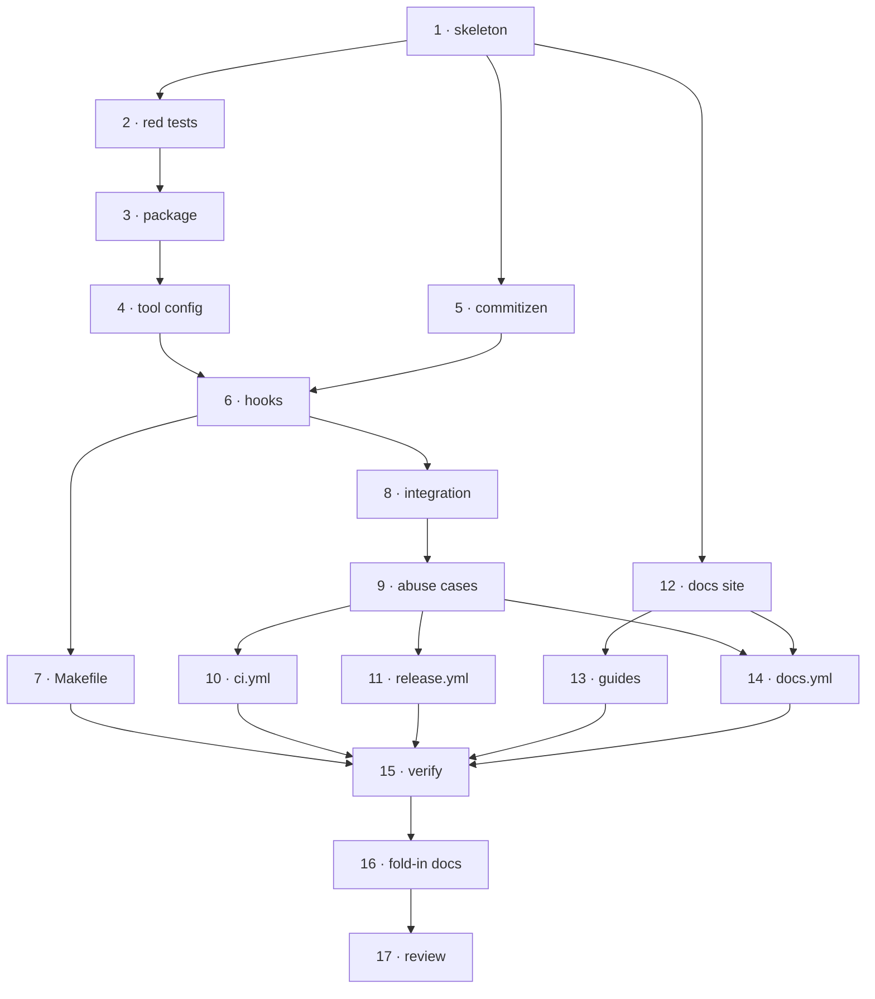

# Tasks: repo tooling setup

> The last spec artifact (requirements → design → testing plan → tasks). A DAG of
> implementation tasks derived from the approved design and testing plan.

## Task list

TDD invariant: **no production code without a failing test that motivates it.** For the
configuration tasks the "production code" is a config file and the failing test is the
tool refusing to run — the red→green transition is recorded in `execution-log.md` for each.

- [ ] 1. Establish the uv project skeleton
  - Root `pyproject.toml`: `[project] name = "yaah"`, version `0.1.0`, Apache-2.0,
    `requires-python`, URLs, hatchling backend with `packages = ["yaah"]`
  - `[dependency-groups] dev`: ruff, pyright, pytest, pre-commit, commitizen
  - `.python-version` pinning the interpreter; `uv sync` producing `.venv/` and `uv.lock`
  - Extend `.gitignore` for `node_modules/` and the VitePress build state
  - _Depends on:_ none
  - _Requirements:_ R1.1–R1.4
  - _Test:_ T2 — `uv sync` resolves and `uv run python -c "import sys"` runs (red→green:
    no `pyproject.toml` → `uv sync` fails)

- [ ] 2. Write the failing tests for `hello_world`
  - `tests/unit/test_hello.py`: default greeting, named greeting, `TypeError` on non-`str`,
    `ValueError` on empty/whitespace
  - _Depends on:_ 1
  - _Requirements:_ R3.1–R3.4
  - _Test:_ T1 — `uv run pytest tests/unit` fails with `ModuleNotFoundError` (red)

- [ ] 3. Implement the `yaah` package
  - `yaah/hello.py` with `hello_world(name: str = "World") -> str` and its validation
  - `yaah/__init__.py` re-exporting it with `__all__`, plus `yaah/py.typed`
  - _Depends on:_ 2
  - _Requirements:_ R1.5, R3.1–R3.4
  - _Test:_ T1 — `uv run pytest tests/unit` (red→green)

- [ ] 4. Configure ruff, pyright and pytest
  - `[tool.ruff]`, `[tool.ruff.lint]`, `[tool.pyright]` (strict, in-repo `.venv`),
    `[tool.pytest.ini_options]` (`testpaths`, `pythonpath`, markers) in `pyproject.toml`
  - `.markdownlint-cli2.jsonc` for the markdown linter
  - _Depends on:_ 3
  - _Requirements:_ R2.1–R2.5
  - _Test:_ T2 — `uv run ruff check`, `uv run ruff format --check`, `uv run pyright` all
    green (red→green: each is configured only after it has been run and seen to fail or be
    unconfigured)

- [ ] 5. Wire commitizen
  - `.cz.toml`: `cz_conventional_commits`, `version = "0.1.0"`, `tag_format = "v$version"`,
    `version_files` keeping `pyproject.toml` in lockstep, `update_changelog_on_bump = false`
  - _Depends on:_ 1
  - _Requirements:_ R4.1–R4.4
  - _Test:_ T2 — `Scenario: A non-conventional commit message is rejected` — `cz check`
    rejects `broken message` and accepts `feat: x` (red→green)

- [ ] 6. Wire the pre-commit hooks
  - `.pre-commit-config.yaml` with the six hooks of the design's table, all through
    `uv run`, `default_install_hook_types: [pre-commit, pre-push, commit-msg]`
  - _Depends on:_ 4, 5
  - _Requirements:_ R5.1–R5.4
  - _Test:_ T2 — `uv run pre-commit run --all-files` green (red→green)

- [ ] 7. Add the `Makefile` task runner
  - `install-dev`, `hooks`, `lint`, `format`, `format-check`, `typecheck`, `test`,
    `test-integration`, `docs`, `check`
  - _Depends on:_ 6
  - _Requirements:_ NFR "one command to check everything"
  - _Test:_ T2 — `make check` green

- [ ] 8. Write the integration suite
  - `tests/integration/test_repo_gate.py` — the package imports under its documented name;
    the pinned toolchain resolves from the lock; the configured tools are the ones that run
  - Gherkin docstrings on every test, each linking its requirement
  - _Depends on:_ 6
  - _Requirements:_ R3.5, R3.6
  - _Test:_ T2 — `uv run pytest tests/integration` (red→green)

- [ ] 9. Write the security/abuse-case tests **before** the workflows
  - `tests/integration/test_workflows.py` — A1–A6 of `design.md` § Security design, parsing
    `.github/workflows/*.yml`
  - _Depends on:_ 8
  - _Requirements:_ R6, R7.6 · abuse cases A1–A6
  - _Test:_ T8 — the suite fails because no workflow exists yet (red)

- [ ] 10. Add `ci.yml`
  - `pull_request` + `push: main`; jobs `quality` (`uv run pre-commit run --all-files`),
    `integration` (`uv run pytest tests/integration`), `docs` (`bun run docs:build`);
    `permissions: contents: read`
  - _Depends on:_ 9
  - _Requirements:_ R6.1–R6.5 · A1, A2
  - _Test:_ T8 — `test_ci_workflow_holds_no_publish_credentials` (red→green)

- [ ] 11. Add `release.yml`
  - `push: main` + `workflow_dispatch`; `concurrency: release`; the `bump:` re-entry guard;
    `cz bump` with the 21/3 no-op handling; push commit + tag; `uv build`; GitHub Release;
    `publish-pypi` job in the `pypi` environment with `id-token: write` and
    `pypa/gh-action-pypi-publish`
  - _Depends on:_ 9
  - _Requirements:_ R7.1–R7.6 · A3, A4, A6
  - _Test:_ T8 — `test_release_scopes_privileges_per_job`,
    `test_release_does_not_re_enter_on_its_own_bump_commit` (red→green)

- [ ] 12. Build the VitePress site
  - `docs/package.json` (bun, vitepress), `docs/.vitepress/config.mts` with the
    filesystem-generated specs sidebar, `docs/index.md` home page
  - _Depends on:_ 1
  - _Requirements:_ R8.1, R8.2, R8.4, R8.6
  - _Test:_ T2 — `Scenario: The documentation site builds from docs/ with a generated
    specs sidebar` (red→green)

- [ ] 13. Write the guide pages
  - `docs/guide/tech-stack.md`, `docs/guide/local-development.md` (including
    `pre-commit install --install-hooks`), `docs/guide/contributing.md`
  - _Depends on:_ 12
  - _Requirements:_ R8.5
  - _Test:_ T2 — the site build resolves every nav and sidebar link

- [ ] 14. Add `docs.yml`
  - `push: main` on docs paths + `workflow_dispatch`; `concurrency: pages`; build with bun;
    `configure-pages` / `upload-pages-artifact` / `deploy-pages`; `github-pages` environment
  - _Depends on:_ 9, 12
  - _Requirements:_ R8.3 · A5
  - _Test:_ T8 — `test_every_action_reference_is_pinned` (red→green)

- [ ] 15. Execute the testing plan and commit the evidence
  - Run every activity in `testing-plan.md`, tick only what ran, fill the results table,
    commit the evidence under `docs/specs/issue-3/evidence/`
  - _Depends on:_ 7, 10, 11, 13, 14
  - _Requirements:_ all
  - _Test:_ T1, T2, T4, T5, T8, T11

- [ ] 16. Fold in the capability, decision and user-facing docs
  - `docs/capabilities/` (mint + index), `docs/decisions/decision-001..004` (+ index and
    `conflicts.md`), `docs/architecture/architecture.md`, `README.md`, and the execution
    log's `## Capability docs` / `## Documentation` sections
  - _Depends on:_ 15
  - _Requirements:_ ready-to-ship gate
  - _Test:_ T2 — markdownlint and the site build cover the new pages

- [ ] 17. Self-review, security review, and the reviewer briefing
  - Review rounds per `reference/reviewing.md`; the security review gate; the R10 briefing
    as the pull-request description
  - _Depends on:_ 16
  - _Requirements:_ ready-to-ship gate
  - _Test:_ T2 — the full gate re-run after every fix

## Dependency graph (DAG)

## Checkpoints

The execution log records a checkpoint after each task: the test command, its **red→green**
transition, and the next step. Tasks 2→3, 5, 9→10/11 and 12 are the explicit red-first
pairs. After task 15 the **verification** node has executed `testing-plan.md`; only then do
the review rounds and the **security review gate** run, and only then can the work item be
marked ready.

## Review comments

_None yet._
